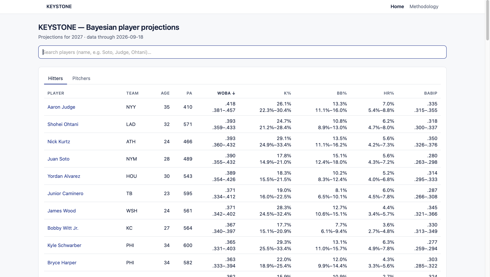
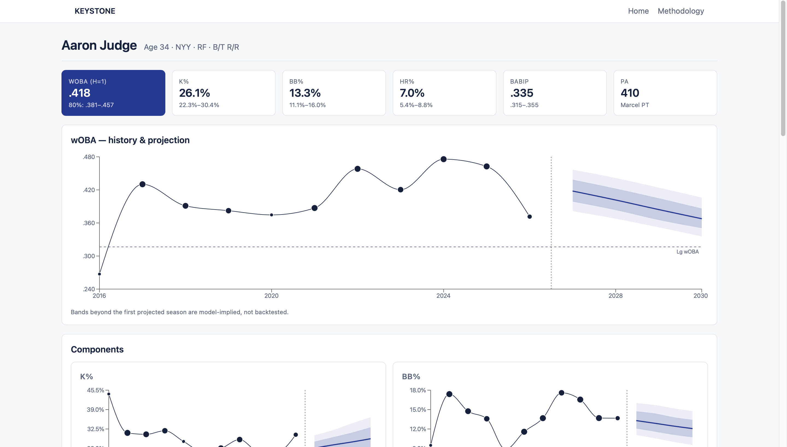
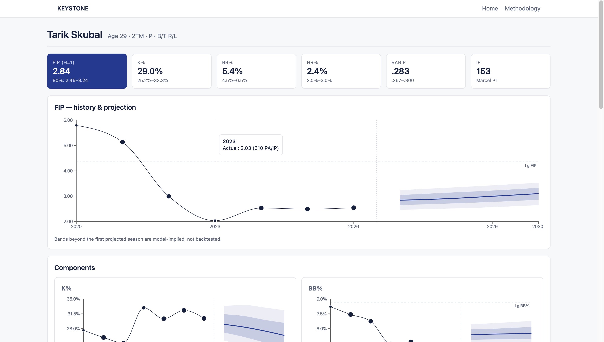
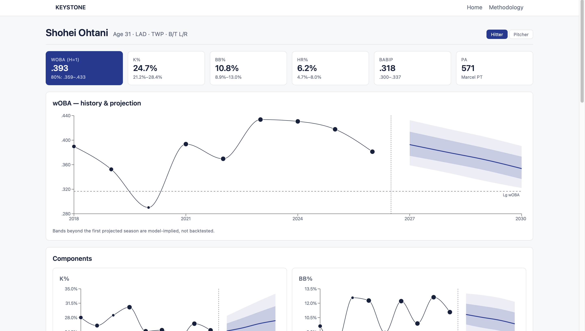
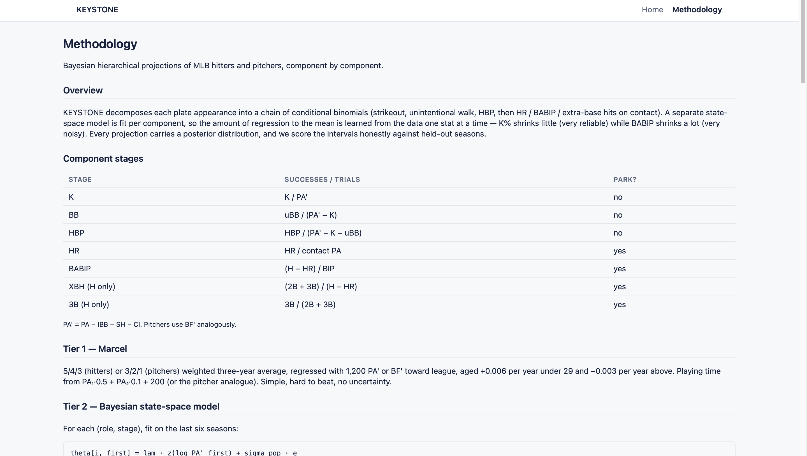

# KEYSTONE — Bayesian MLB player projections

KEYSTONE projects MLB hitters and pitchers component by component (K, BB, HBP, HR, BABIP, XBH,
3B), with one hierarchical state-space model per stage, and derives wOBA and FIP from those stages.
It comes with a scouting-report web app. Every modelling change was pre-registered and scored
against Marcel. **The Bayesian model did not beat Marcel on the key stats, so production ships
Marcel points with Bayesian bands, and those bands passed their calibration check on the 2025
holdout.**

**Read the memo first:** [`docs/research_memo.md`](docs/research_memo.md). It covers the
methodology, the negative results, what each research mission changed, and the open problems.

## Results

Dev targets 2021–2024 plus the one-time 2025 holdout; PA′-weighted RMSE
(`data/artifacts/backtest.json`):

| key stat | Marcel dev mean | Tier 2 dev mean | Tier 2 dev wins | Tier 2 cov80 | 2025 Marcel | 2025 Tier 2 (cov80) |
|---|---|---|---|---|---|---|
| H wOBA | .0334 | .0328 | 2/4 (need 3) | .819 | .0305 | .0309 (.83) |
| P FIP | .7947 | .8164 | 1/4 (need 3) | .761 | .7317 | .7399 (.75) |

- Both gates fail, so production is **Marcel points + Tier 2 bands** (`production_tier: marcel`).
- On 2025, Tier 2 won 5 of 8 component rows (BABIP for both roles, P K%, P HR%, H BB%) but lost both aggregates.
- The playing-time hurdle beat Marcel PT in **8/8** dev targets and ships (`docs/fable/M3_playing_time.md`).
- **ML challenger:** we red-teamed the Bayesian model with a gradient-boosted challenger on an
  identical information set, plus a Bayesian+GBM hybrid, and compared them on point RMSE and CRPS
  under pre-registered accept rules. On hitters the hierarchical model beat both challengers on
  every score. On pitchers the challengers beat the Bayesian FIP points, which is evidence that
  cross-stage information (discarded when stages are modelled independently) is real signal for
  pitchers. Neither challenger cleared the shipping gate against Marcel, so production is unchanged
  (`docs/fable/M4_ml_challenger.md`).

## Stack

PyMC 5.28 + nutpie · pandas/pyarrow · FastAPI (read-only; loads artifacts, never fits) ·
React 19 + Vite + Recharts · MLB Stats API data 2015–2026 + a FanGraphs guts CSV.

```
MLB Stats API ──► data/processed/*.parquet ──► Marcel (Tier 1)  ─┐
                                        └────► state-space per   ├─► backtest.json (gates)
                                               (role, stage)      │   projections / waterfall /
                                               + PT hurdle  ──────┘   aging / pt  (data/artifacts)
                                                                          │
                                                   FastAPI (read-only) ◄──┘ ──► React + Recharts
```

## Run it

```
make setup          # venv + pinned deps (Python 3.11–3.14)
make test           # backend tests
make data           # fetch + build processed tables (~5–10 min; needs data/external/fg_guts.csv)
make backtest       # full dev backtest (long)
make project        # production artifacts (~35 min)
make api            # FastAPI on :8000
make web            # Vite dev server on :5173
```

`make holdout` has already been run once and the 2025 holdout is spent. Don't re-run it.

## Screenshots

Retaken 2026-09-18 on the shipped build (locked M2 config, M3 playing-time outlook, four-step waterfall).

| | |
|---|---|
| Home / search — the landing page with player search |  |
| Aaron Judge — hitter card: wOBA fan chart, component waterfall, multi-year outlook with the MLB-regular chip |  |
| Tarik Skubal — the pitcher example: FIP projection with K/BB/HR components and IP-based expected production |  |
| Shohei Ohtani — the two-way case: hitter and pitcher projections on one card |  |
| Methodology — model equations, fitted stage parameters, validation tables |  |

## Limitations

- Beyond year 1, intervals are model-implied and have not been backtested.
- Playing time is displayed for year 1 only, deliberately. The PT model is backtested at h1 only,
  and at h2+ it feeds its own simulated healthy seasons back in as recent PT, so injury-depressed
  stars' PT rises with age (Judge 545 → 646 PA at 35–38 while wOBA falls .419 → .369). Years 2–4
  show rates only (memo §5).
- The production fit isn't fully converged: max r_hat 1.16 and 89 divergences across 12 fits.
- Stages are fitted independently. No prospects, defense, baserunning or WAR.

## What I'd do next

Correlated pitcher stages (the M4 lead), scored first on 2026 targets under a pre-registered
rule; a bootstrap gate on mean RMSE; h2–h4 calibration backtests; MiLB translations; pitch-level
Stuff+ indicators.
